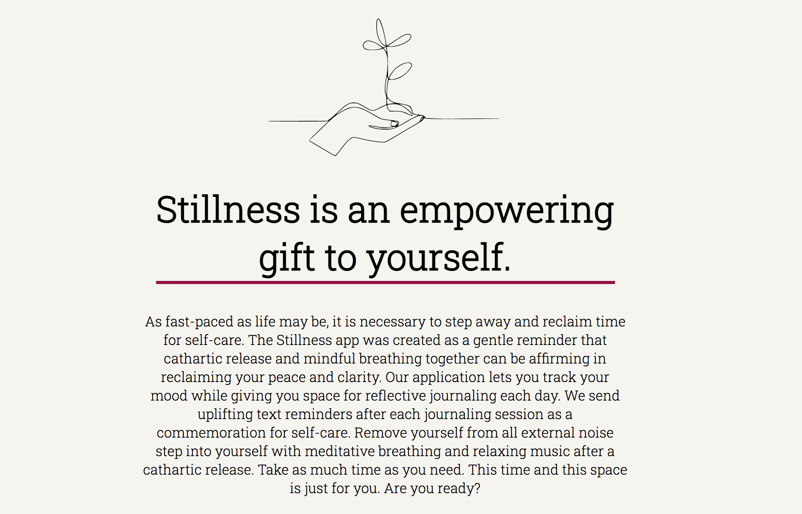

# The Stillness App

## App Background: 
A full-stack web application that allows users to track their mood and journal their thoughts. Upon submitting their mood and journal entry, users receive a motivational or uplifting text message as a gentle reminder their act of self-care is valuable.

## Development And Design
## Tech Used
HTML, CSS, JavaScript, React, Node, Express,MongoDB, Passport,  Twilio for text messaging, Material UI library.

## Future Optimizations
This application currently does not allow a user to opt out of receiving text messages. In the future, I would like to implement this option. I would also like to add more features to the journaling section so users can have the choice to change their font/font color and size (for accessibility or just to have the option to do so). 
